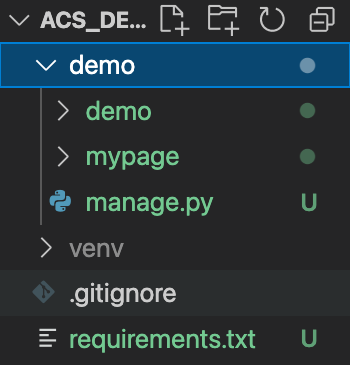
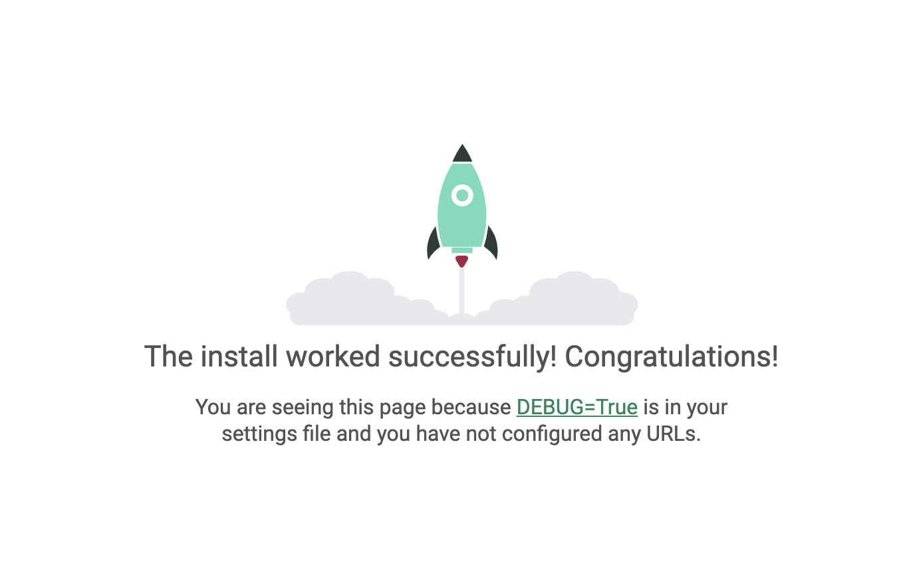
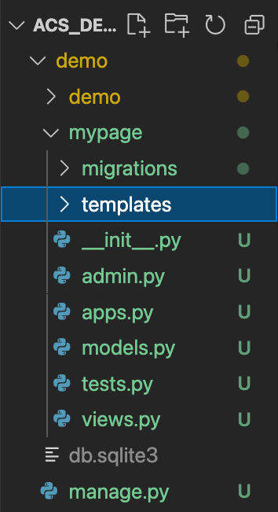
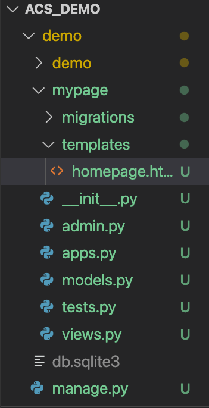
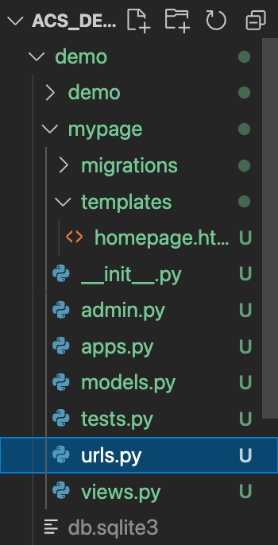

# Setting Up A Static Site In Django

Django is a powerful and flexible tool, designed to serve all sorts of complex, full-stack websites. Today we are going to use it for something a bit simpler: serving a single, static page of HTML. It's not much, but it's a good place to start!

This walkthrough requires you to have the tools listed in the 
README installed. 

## Step A - The Repo

If we're ever going to put our website up live on the internet, we're going to need some way of setting up our code in the cloud. In that instance won't be serving our website from our home computers (that would be annoying and unreliable). Instead, we'll create our code locally and then upload it to an online service like Heroku, which will run our code for us, and make the website it generates it available to the rest of the world. 

To do this, we need some way of storing and sharing our code online. We'll be using Github.

1. Visit [www.github.com](https://github.com/). If you don't have an account, you'll need to make one, and [set up your local installation of GIT to cooperate with Github](https://docs.github.com/en/get-started/quickstart/set-up-git). 
2. In the action bar on the left of the page, click on 
3. Select a name for your repository. I'm going with "ACS_Demo".
4. Check the box labelled `Add .gitignore`. From the dropdown list that appears, select `Python`.
5. Click `Create Repository`.

You now have a blank repository for Python code, stored online courtesy of Github, ready for you to begin adding your work!

6. Click on  and copy the link that pops up.

7. Open the command line interface on your local computer.

8. Navigate to wherever you want to store your code, and enter the command
```shell
git clone <paste_your_link_here>
```

That's the repo set up! GIT will download a copy of it from Github for you, and create a link between your local version and the cloud version.

## Step B - The Environment

Our next step is to get all the tools we'll need for coding with Django ready. 

1. In the command line, navigate into the repository you cloned in the previous step.
2. Using the following command, create a virtual environment to handle the software packages we'll be installing. That way, they won't clog up the rest of our computer.
```shell
virtualenv venv
```
3. Activate the virtual environment. 
```shell
# On Linux and Mac, the command is:
source venv/bin/activate

# On Windows, use:
venv/Scripts/activate
```

4. Install the packages we'll need for this project:
```shell
pip install django
```
```shell
pip install gunicorn
```
5. Create a dependencies file, so that when your code is pushed to a service like Heroku, those same packages will be automatically installed:
```shell
pip freeze > requirements.txt
```

## Step C - The Project

1. Setting up a blank Django project is as simple as one command: 

```shell
django-admin startproject demo
```
I've chosen to call my project "demo". You could pick a different name if you wanted to. Running this command will create a new folder containing all the boilerplate code required to make a basic Django project run.

A Django project can contain a number of "apps", which all work together to make your website/s work. We'll create just one. I'm going to call my app "mypage".

2. Navigate into the demo folder you just created:

```shell
cd demo
```
3. Run the following command:

```shell
python manage.py startapp mypage
```

## Step D - Tweaking Some Settings...

1. Open your repository in VS Code. If you're following along from the above steps, you should be able to open that location in the VS Code editor with the following command:

```shell
code ..
```

If everything has gone smoothly, you should be able to see a file structure something like this:



Our repo has a few things going on! We have a folder for our virtual environment files, called `venv`. We have a `.gitignore` file. We have a `requirements.txt` file. And most importantly we have the folder for our project: `demo`.

Inside of that `demo` folder is... another folder called demo! And also a folder for our app, `mypage`.

<aside>It might be confusing to have two folders called `demo`, one in side the other. There's a good reason for it, though. Our `mypage` app folder will contain all the files we need to make that particular app work. But a more complex project could have lots of apps, and lots of folders. On the other hand, there are some files that are required to make the whole project go, and we don't want them all floating around loose. For that reason, we have another folder for them, with the same name as the overall project.<aside>

2. The first code we need to write involves a small change to the settings for our overal project. Open that "inner" `demo` folder in VS Code, and you'll find a file called `settings.py`. Scrolling through this file, you should find a section like this:

```python
INSTALLED_APPS = [
    'django.contrib.admin',
    'django.contrib.auth',
    'django.contrib.contenttypes',
    'django.contrib.sessions',
    'django.contrib.messages',
    'django.contrib.staticfiles',
]
```

We want to add one line right above that closing square bracket, like so:

```python
INSTALLED_APPS = [
    'django.contrib.admin',
    'django.contrib.auth',
    'django.contrib.contenttypes',
    'django.contrib.sessions',
    'django.contrib.messages',
    'django.contrib.staticfiles',
    'mypage',
]
```

This registers the `mypage` app we are writing with the project, so that Django knows to include it when the code runs.

Our next step is to perform a "migration". Jumping over some lengthy explanation... Django is designed to do a whole range of things, including interacting with databases. We aren't using the database interface in this walkthrough, but Django is still expecting us to know it's there, and if we don't let it set that system for us, it's going give us some error messages. So let's give it what it wants. 

3. Jump back into the terminal, and run the following command:

```shell
python manage.py migrate
```

Finally, let's check that everything is set up correctly by running the website. 

4. Run the following command in the terminal:

```shell
python manage.py runserver
```

If everything went well, you should see a link in the output: [http://127.0.0.1:8000/](http://127.0.0.1:8000/). Try visiting that address in your browser!



We are on our way!!

## Step E - Time to Code!

... finally!

We are ready to start coding in earnest. First of all, let's set up a folder to hold the page that our users will see"

1. Create a new folder called `templates`, inside of your `mypage` directory.



2. Inside of that folder, create a file called `homepage.html`.



3. Let's add some basic HTML code to that file, to define what our users will see. If you know your way around HTML you can add whatever you like, but here's some fun boilerplate to throw in if you prefer:

```html
<!DOCTYPE html>
<html lang="en">
    <head>
        <title>Elmo's "Sloppy Oscars"</title>
    </head>

    <body>
        <header>
            <h1>Elmo's Recipe for "Sloppy Oscars"</h1>
        </header>
        <br>
        <main>
            <div>
                
                <aside>
                    <p>
                        <em>"It's gross stuff, but it tastes good when it's put all together."</em> 
                        <br/>- Elmo, 2015
                    </p>
                </aside>
                
            </div>
            <div>
                <aside>
                    <p>
                        All recipe pages have a giant tract of pointless text at the top of them, so here it is:
                        <br><br>
                        "Sed ut perspiciatis unde omnis iste natus error sit voluptatem accusantium doloremque laudantium, totam rem aperiam, eaque ipsa quae ab illo inventore veritatis et quasi architecto beatae vitae dicta sunt explicabo. Nemo enim ipsam voluptatem quia voluptas sit aspernatur aut odit aut fugit, sed quia consequuntur magni dolores eos qui ratione voluptatem sequi nesciunt. Neque porro quisquam est, qui dolorem ipsum quia dolor sit amet, consectetur, adipisci velit, sed quia non numquam eius modi tempora incidunt ut labore et dolore magnam aliquam quaerat voluptatem. Ut enim ad minima veniam, quis nostrum exercitationem ullam corporis suscipit laboriosam, nisi ut aliquid ex ea commodi consequatur? Quis autem vel eum iure reprehenderit qui in ea voluptate velit esse quam nihil molestiae consequatur, vel illum qui dolorem eum fugiat quo voluptas nulla pariatur?"
                    </p>
                </aside>
                <section>
                    <p>
                        This is the recipe that Elmo gave to Jimmy Fallon for his "Sloppy Oscar" burgers.
                    </p>
                </section>
                <br>
                <section>
                    <h2>
                        The ingredients for Sloppy Oscars are:
                    </h2>
                    <ul>
                        <li>Onions</li>
                        <li>Garlic</li>
                        <li>Celery</li>
                        <li>Balsamic Vinegar</li>
                    </ul>
                </section>
            </div>
        </main>
        
        <footer>
            <p>See <a href="https://youtu.be/YN1hL9cn7s0">this instructional video</a> for more information.</p>
        </footer>
    </body>
</html>
```

I won't mess around with CSS or Javascript right now. I leave that as an exercise for the reader.

4. Next we need to tell Django how to use this file. We'll do this with a `view`. Navigate to the `/mypage/views.py` file in VSCode, and add the following code to that file:

```python
def homepage(request):
    return render(request, 'homepage.html')
```

Basically here, we're saying: "when someone asks for the webpage, you should return it to them by rendering the index.html file as a response". 

5. Next we need to define the address that this page will be available at inside our app. Let's add a `urls.py` file to the `mypage` directory:



6. Here's some code to add to that file:

```python
from django.urls import path
from . import views

urlpatterns = [
    path('', views.homepage, name='homepage'),
]
```

This code is saying: "the default url for this app should be connected to that `homepage` view we just defined." 

7. The page is available from within the app, right now, but next we need to make it so that we can access that app from within the project as a whole. To do this we need to add a little code to a different `urls.py` file - the one in the `demo` directory. This file already exists, so we can just add a little code to it:

```python
from django.contrib import admin
from django.urls import path, include

urlpatterns = [
    path('admin/', admin.site.urls),
    path('homepage/', include('mypage.urls'))
]
```

The code we've added here is the line right before that closing square-bracket.

8. We should now be ready to access our new web-page. If you shut down the server after running it earlier, start it up again with:

```shell
python manage.py runserver
```

Your new page should be available from [http://127.0.0.1:8000/homepage/](http://127.0.0.1:8000/homepage/)!


